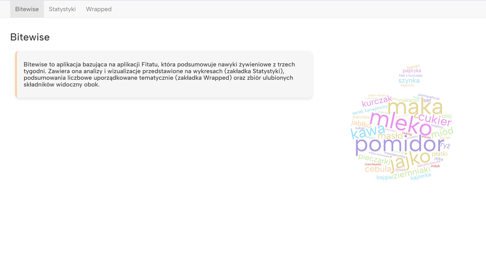
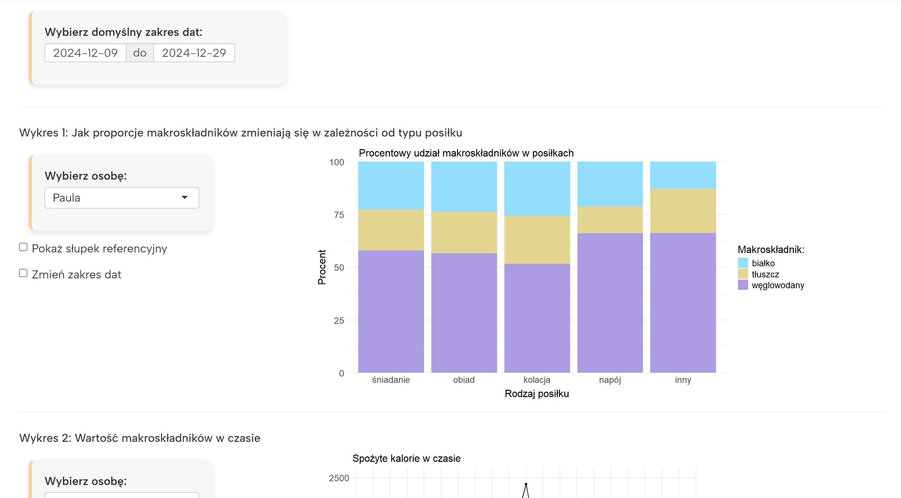
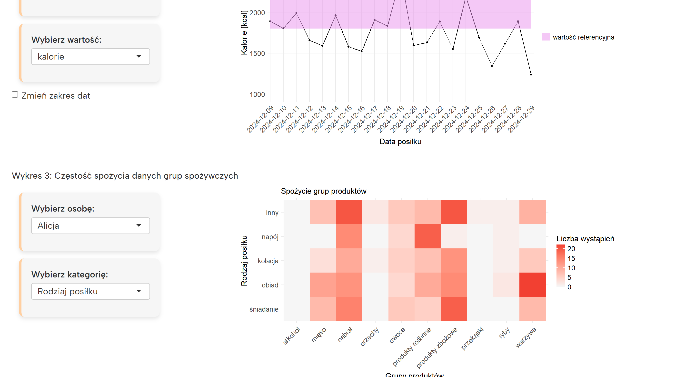
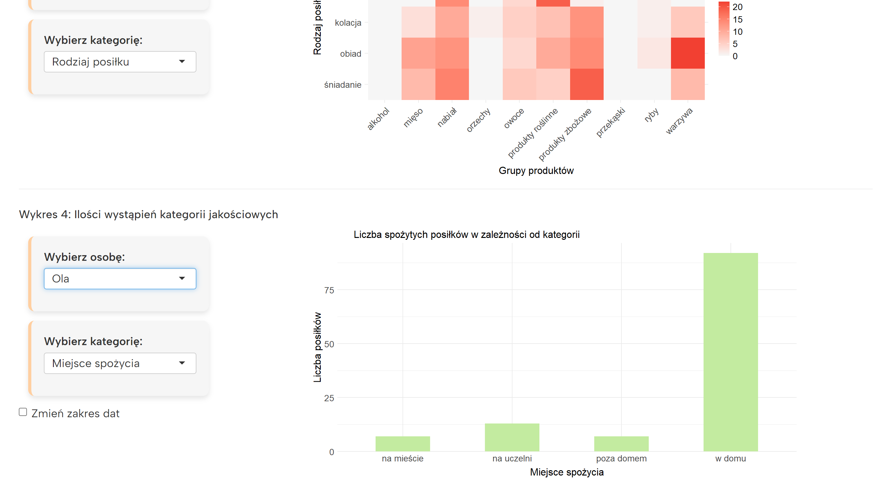
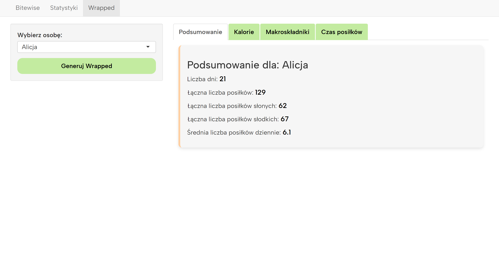
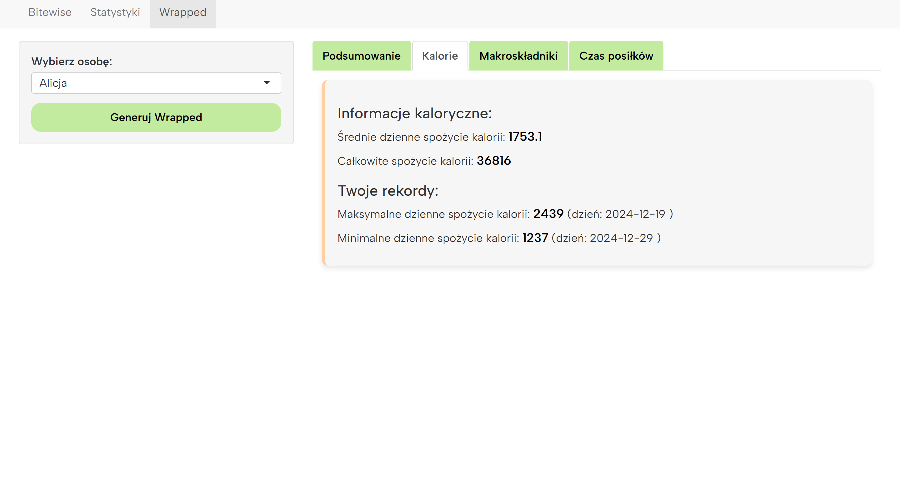
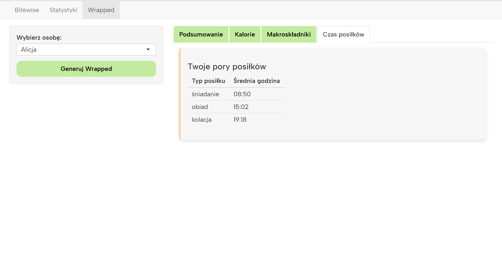

# Bitewise
## Opis projektu
Projekt aplikacji Shiny zrealizowany w ramach przedmiotu Wizualizacja danych na Politechnice Warszawskiej (wykonany w roku akademickim 2024/2025). Celem aplikacji jest analiza i prezentacja nawyków żywieniowych za pomocą interaktywnych wizualizacji i wykresów. Dane wykorzystane w projekcie obejmują okres trzech tygodni. Aplikacja jest dostępna pod adresem: https://olazaw.shinyapps.io/proj2/.

Autorzy: Alicja Przeździecka, Paula Wołkowska, Aleksandra Zawadka.

## Podgląd apliakcji
### Główne okno aplikacji

  

### Zakładka statystyki

    
    
    

### Podsumowania

    
    

    
    

# Bitewise
## Description
The Bitewise project is a Shiny application developed as part of the Data Visualization course at the Warsaw University of Technology during the 2024/2025 academic year. The goal of the application is to analyze and present eating habits through interactive visualizations and charts. The dataset used in the project covers a period of three weeks. The application is available at: https://olazaw.shinyapps.io/proj2/.

Authors: Alicja Przeździecka, Paula Wołkowska, Aleksandra Zawadka.

## Application preview
### Main window

  

### Statistic tab

    
    
    

### Summaries

    
    

    
    

